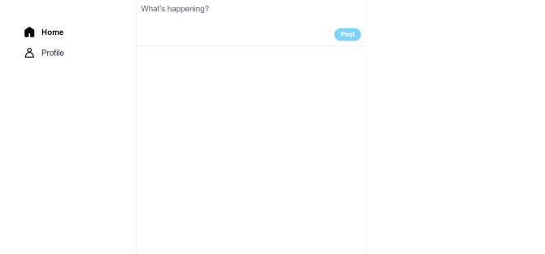
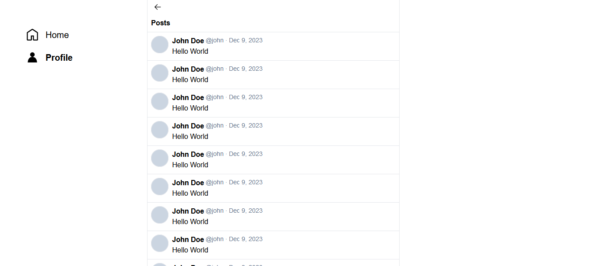
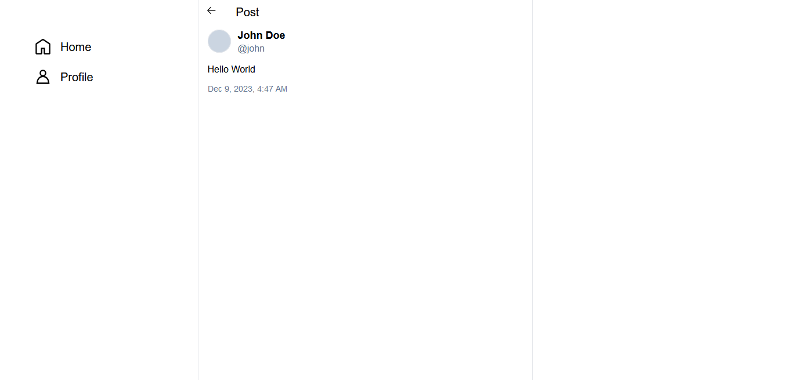

# Twitter

It is a clone of the Twitter web app--currently under development--that aims to reliably implement core features like creating posts, searching posts, liking posts, trending, following, and messaging. It's a Monolith, but it can easily be deployed as Microservices if needed--it uses Clean Architecture. It sticks to the original UI design on different screen sizes.

Decisions that increase the quality of the codebase:

- Following Robert C. Martin’s Clean Code guidelines
- Using Clean Architecture to isolate the business rules from details(UI, framework, database, etc…) and to increase testability
- Using TDD(Test Driven Development) to write high-quality code with executable documentation and a high test coverage
- Committing directly to the main branch to embrace the spirit of CI(Continuous Integration) as a solo developer
- Following Kent C. Dodds’ advice on UI testing(decreasing fragility and increasing confidence by focusing on integration tests)
- Using CDCs(Consumer-Driven Contracts) to reduce the need for Full Stack E2e tests

## Completed Features

- Create posts
- Read posts
- Search posts

## Screenshots







## Environment Variables

### Server environment variables

#### Optional

- `PORT` - The port the server will be listening on

### Client environment variables

#### Required in staging and production

- `NEXT_PUBLIC_API_BASE_URL` - The URL the server is running on

#### Required in development

- `NEXT_PUBLIC_API_MOCKING` - Used to mock server requests

## Running Locally

- Install dependencies:

```bash
  npm install
```

- Start server project:

```bash
  npx nx run server:serve
```

- Set required client environment variables

```bash
  NEXT_PUBLIC_API_BASE_URL={Eg. http://localhost:3000}
```

- Start client project

```bash
  npx nx run client:serve
```

## Running Tests

Client tests:

```bash
  npm nx run client:test
```

Server tests:

```bash
  npm nx run server:test
```

## Tech Stack

**Client:** Typescript, Next.js, TailwindCSS, Redux

**Server:** Typescript, Node.js, ExpressJS, GraphQL

## GraphQL API Reference

```graphql
type Query {
  hello: String
  post(id: ID!): Post
  posts(userId: ID!, limit: Int!, offset: Int!): [Post]
  searchPosts(query: String!, limit: Int!, offset: Int!): [Post]
}

type Mutation {
  createPost(text: String!): Post
}

type Post {
  id: ID!
  text: String!
  userId: ID!
  createdAt: String!
}
```
